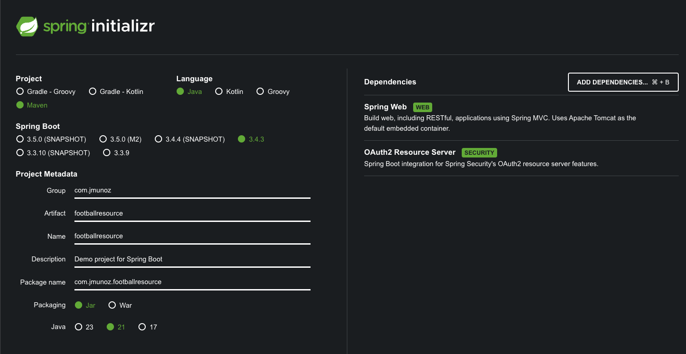
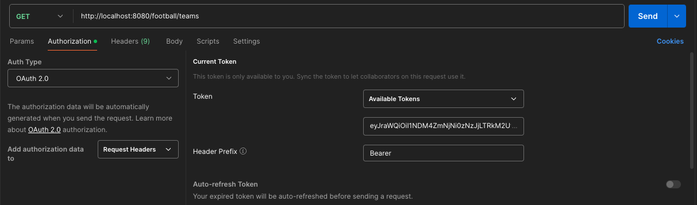
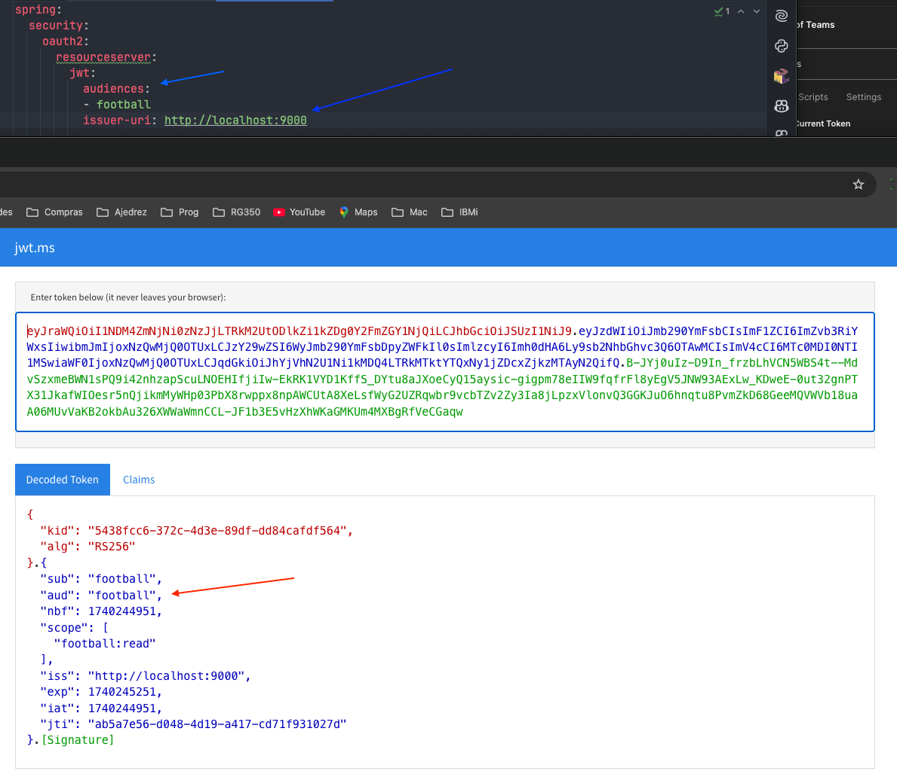

# SPRING BOOT 3 COOKBOOK

Configuración de un resource server.

Un resource server delega la autorización para acceder a un servidor de terceros, es decir, un authorization server.

Lo que vamos a hacer es configurar esta aplicación API RESTful para que autorice peticiones que son emitidas por el Spring Authorization Server.

Es decir, vamos a permitir clientes con acceso concedido por nuestro Authorization Server.

Vamos a usar como dependencias `Spring Web` y `Oauth2 Resource Server`.

## Creación de proyecto

Uso Spring Initializr: `https://start.spring.io/`

## Ejecución del proyecto

- Clonar/descargar este proyecto
- Ejecutar el proyecto con el comando: `./mvnw spring-boot:run`
    - O ejecutar directamente desde IntelliJ Idea
- Ejecutar también el proyecto del Authorization Server
  - `https://github.com/JoseManuelMunozManzano/Spring-Boot-football-auth`
- En la carpeta `postman` se encuentra el endpoint para hacer pruebas
  - Si ejecutamos directamente el GET que obtiene la lista de teams, veremos el error `401 Unauthorized`
  - Tenemos que obtener un token usando el `Authorization Server` (ver como obtenerlo en su README.md)
  - Una vez obtenido el token, lo copiamos y lo informamos en nuestro endpoint del Resource Server
    - 
  - Tener en cuenta que hay dos scopes, uno de solo lectura y otro tipo admin (para el POST)
    - El auth server puede mandar solo uno de los dos o los dos. Tenerlo en cuenta

## Configuración de un resource server

Vamos a crear un nuevo API RESTful y configurarlo como un resource server.

Creamos una carpeta `controllers` y dentro el controlador `Football.java`.

Creamos un fichero `application.yml` en la carpeta `resources` y lo informamos.

El resource server valida la autenticidad e integridad del token expedido por nuestro authorization server.

El token suele tener un formato JWT (Json Web Token) codificado en Base64 que consiste en tres partes:

- header: contiene metadata necesaria para gestionar el token
- payload: contiene la data y afirmaciones sobre el token, como el tiempo de expiración, editores...
- signature: se crea cogiendo el header y el payload codificados junto a un secret, y se usa un algoritmo de firma especificado en el header. La signature se usa para verificar la autenticidad e integridad de nuestro token. Con esto nos asegueramos de que el token no ha sido modificado

Spring Resource Server sabe como recuperar toda la información del authorization server automáticamente.

Solo tenemos que configurar en `application.yml` la property `issuer-uri`.

La primera vez que el resource server necesita validar el JWT, llama al endpoint `.well-known/openid-configuration` proporcionado por el authorization server y recupera toda la información que necesita, entre ellos, el `JSON Web Key Set (JWKS)` endpoint, que contiene la clave de sign-in.

Estos JWKS son las claves públicas que el authorization server usa para firmar un token. Los clientes descargan esas keys para validar la firma del JWT.

El resource server valida que ese token es para un API RESTful concreto gracias a la property `audiences`, que indica la entidad para la que el token es válido.

Si vemos nuestro JWT decodificado, veremos que hay una parte `aud` que será aceptada solo por el resource server con el mismo `audiences`.

Por tanto, con las properties `audiences` y `issuer-uri` nos aseguramos que nuestro JWT solo funciona para lo que queremos.

## Protegiendo un API RESTful usando OAuth2 con diferentes scopes

Ver el proyecto de authorization server, el punto con el mismo título. Ahí indicamos que se crean distintos `scopes`, uno de solo lectura y otro para el administrador.

Aquí vamos a crear un endpoint `POST` que requiere acceso tipo admin, en nuestro controlador `Football.java`.

También tenemos que poder gestionar los `scopes`. Creamos una carpeta `config` y dentro un archivo `SecurityConfig.java`.

El bean `SecurityFilterChain` es un componente que se usa para configurar los filtros de seguridad, que interceptan y procesan peticiones HTTP entrantes.

## Chequeando roles o claims

Se pueden realizar más validaciones sobre JWT. Una muy común de validación de peticiones es chequeando sus roles.

Modificamos nuestro archivo `SecurityConfig.java` para añadir un nuevo bean `SecurityFilterChain` para que solo usuarios con el rol ADMIN pueda eralizar peticiones POST.

También podemos realizar más validaciones a nuestros token, por ejemplo, validar que un `claim` dado está presente en nuestro JWT.

Creamos para esto una nueva clase `CustomClaimValidator.java` en nuestra carpeta `config`.

## Configurando una aplicación MVC con autenticación OpenId

Para este proyeto, ver también el proyecto `https://github.com/JoseManuelMunozManzano/footballui-openid-authentication`.

Tenemos que permitir a la aplicación web `footballui` usar el API RESTful, así que tenemos que aceptar su audiencia.

Eso se hace añadiendo en `application.yml`, a la propiedad `audiences` la audience indicada en el proyecto `footballui`,

